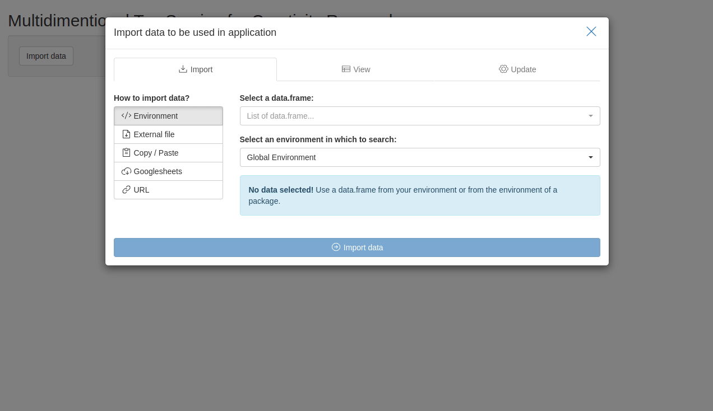

<!-- README.md is generated from README.Rmd. Please edit that file -->

```{r, include = FALSE}
knitr::opts_chunk$set(
  collapse = TRUE,
  comment = "#>",
  fig.path = "man/figures/README-",
  out.width = "100%"
)
```

# Multidimensional Top Scoring for Creativity Research  {#multidimentional-top-scoring-for-creativity-research}

<!-- badges: start -->

[](https://codecov.io/gh/jakub-jedrusiak/mtscr) [](https://github.com/jakub-jedrusiak/mtscr/actions/workflows/R-CMD-check.yaml)
[](https://lifecycle.r-lib.org/articles/stages.html#experimental)
[](https://CRAN.R-project.org/package=mtscr)
<!-- badges: end -->

An R adaptation of Multidimensional Top Scoring method presented by Forthmann, Karwowski and Beaty ([2023](https://doi.org/10.1037/aca0000571)) using the code from the [OSF database](https://osf.io/7rgsp/). The code was adapted to use the [tidyverse](https://www.tidyverse.org/) framework for greater flexibility.

## Installation {#installation}

You can install the development version of mtscr from [GitHub](https://github.com/) with:

``` r
# install.packages("devtools")
devtools::install_github("jakub-jedrusiak/mtscr")
```

The mtscr package is not on CRAN yet.

## Usage {#usage}

Basic usage involves scoring participants' responses to a divergent thinking task. The package includes a sample dataset `mtscr_creativity` with 4652 responses to the [Alternative Uses Task](https://en.wikipedia.org/wiki/Alternative_uses_test) with semantic distance scored. The dataset comes from the original paper (Forthmann, Karwowski and Beaty, [2023](https://doi.org/10.1037/aca0000571)).

The main function is `mtscr_scores()` which returns a dataframe with scored responses. It takes a dataframe with responses, an ID column, an item column and a score column as arguments. The score column should contain semantic distance scores for each response. The function adds columns with scores for each person. The number of creativity scores is based on a given number of top answers provided by the `top` argument.

```{r}
library("mtscr")
data("mtscr_creativity", package = "mtscr")

mtscr_score(mtscr_creativity, id, item, SemDis_MEAN, top = 1:2)
```

`mtscr_score()` does everything automatically. You can also use `mtscr_prepare()` to get your data prepared for modelling by hand and `mtscr_model()` to get the model object. See the functions' documentation for more details.

The model can be summarised to obtain the parameters and reliability estimates.

```{r}
mtscr_model(mtscr_creativity, id, item, SemDis_MEAN, top = 1:3) |>
  mtscr_model_summary()
```

### Graphical User Interface {#graphical-user-interface}

This package includes a Shiny app which can be used as a GUI. You can find "mtscr GUI" option in RStudio's Addins menu. Alternatively execute `mtscr_app()` to run it.



> Try web based version [here](https://jakub-jedrusiak.shinyapps.io/mtscr_GUI/)!

First thing you see after running the app is [`datamods`](https://github.com/dreamRs/datamods) window for importing your data. You can use the data already loaded in your environment or any other option. Then you'll see four dropdown lists used to choose arguments for `mtscr_model()` and `mtscr_score()` functions. Consult these functions' documentation for more details (execute `?mtscr_score` in the console). When the parameters are chosen, click "Generate model" button. After a while (up to a dozen or so seconds) models' parameters and are shown along with a scored dataframe.

You can download your data as a .csv or an .xlsx file using buttons in the sidebar. You can either download the scores only (i.e. the dataframe you see displayed) or your whole data with scores columns added.

For testing purposes, you may use `mtscr_creativity` dataframe. In the importing window change "Global Environment" to "mtscr" and our dataframe should appear in the upper dropdown list. Use `id` for the ID column, `item` for the item column and `SemDis_MEAN` for the score column.

## Contact {#contact}

Correspondence concerning the meritorical side of these solutions should be addressed to Boris Forthmann, Institute of Psychology, University of Münster, Fliednerstrasse 21, 48149 Münster, Germany. Email: [boris.forthmann\@wwu.de](mailto:boris.forthmann@wwu.de){.email}.

The maintainer of the R package is Jakub Jędrusiak and the technical concerns should be directed to him. Well, me. Best way is to open a [discussion on GitHub](https://github.com/jakub-jedrusiak/mtscr/discussions). Technical difficulties may deserve an [issue](https://github.com/jakub-jedrusiak/mtscr/issues).
